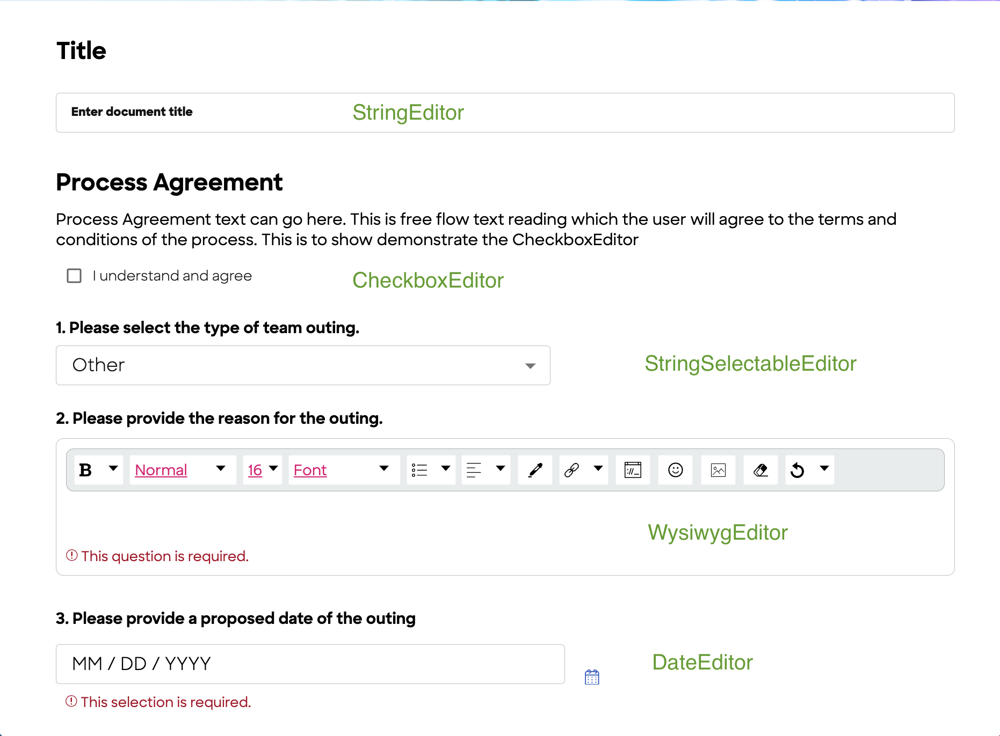

# Developers Guide (How to Change the Application per Business Needs)

Let's understand how to configure a DLMS application by examining the following use case.

## 1.0 Use Case
**Use Case:** Create an application which can be used to create a team-outing request by a Requestor and provide the ability for a Reviewer to approve/reject the request.

Requirements:

**Step 1:** Define all of the information that will be required by the app

The app should be able to ask for the following input from the Requestor

| Requirement Question                                             | Input Type |
|------------------------------------------------------------------|------------|
| Enter the type of activity that they are requesting approval for | List       |
| Enter the justification or reason for the Team Outing            | TextArea   |
| Provide a vendor for the Team Outing         | TextField   |
| Enter a date of the Team Outing         | Date   |

**Step 2:** Define all of the actors involved in the end-to-end process

We envision 3 actors in this scenario:

| Actor         | Description      |
|---------------|------------------|
|Requestor|A user who creates a request|
|Reviewer|A user who is capable of reviewing a request|
|Administrator|A user who administers the application, manages the work flow|

**Step 3:** Define all of the actions that could occur during the end-to-end process

The following actions (buttons) that can be triggered on a request

| Action          | Button Label|
|-----------------|---------------|
| Create          |New Team-Outing Request|
| Submit          |Submit Request|
| Cancel          |Cancel Request|
| Deny            |Deny|
| Approve         |Approve|
| Request More Info         |Request-Info|

**Step 4:** Define all the states that a request may have in your end-to-end process

A request may enter the following states:

| Request State         | Description      | Trigger |
|---------------|------------------|------------------|
|created|A request attains created state as soon as the request is generated|
|submitted|A request attains the submitted state when the request is submitted for review| `Submit` button
|moreinforequested|A request attains moreinforequested when reviewer requires more information from the Requestor| `Request-Info` button
|approved|A request attains approved state when Reviewer approves the request| `Approve` button
|denied|A request attains denied state when Reviewer denies the request| `Deny` button
|cancelled|A request attains cancelled state when the request is cancelled| `Cancel` button

**Step 5:** Compose a table that outlines all of the possible states that a request can take, who can interact with the request in each state, what actions can occur on a request in a given state that will cause a state change, and what other possible states can a request enter from a given state.

Below is how an actor will act on a Team Outing request based on the state of the request

| Actor                                             | Request Current State|Action |Request Future State|
|---------------------------------------------------|--------------|------------|----|
| Requestor |  created    |submit|submitted|
| Requestor |  created    |cancel|cancelled|
| Requestor |  submitted    |cancel|cancelled|
| Requestor |  moreinforequested   |submit|submitted|
| Requestor |  moreinforequested   |cancel|cancelled|
| Requestor |  approved / denied   |None|N/A|
| Reviewer |  created    |cancel|cancelled|
| Reviewer |  submitted    |approve|approved|
| Reviewer |  submitted    |deny|denied|
| Reviewer |  submitted    |request-more-info|moreinforequested|
| Reviewer |  moreinforequested / approved / denied    |None|NA|

**Step 6:** Map all the different phases to a state

A request will be shown in UI to be in 3 different phases. Below is the phase vs state mapping

| Phases                     | State                         |
|----------------------------|-------------------------------|
| created                    | created                       |
| underReview                | submitted / moreinforequested |
| done                       | approved / denied / cancelled |

After mapping all the information above you’ll be ready to start implementing your
application.

## 2.0 Defining Phases
1. All the phases can be defined in `src/ui/src/common/states.ts` inside an interface like below
    ```
    export interface Phases {
        created: Phase;
        underReview: Phase;
        done: Phase;
    }
    ```
2. The different phases of a request will indicated to the user as the request progresses through its lifecycle
   

## 3.0 Defining Roles

Roles are required to bind actors to restrict access. For this application we are going to introduce the following roles

```
export const Role = {
    Administrator: "Admin",
    Requestor: "requestors",
    Reviewer: "reviewers",
    Employee: "Employee",
    ReviewerGroup: "ReviewerGroup",
}
```
In the above code there are 4 roles defined, e.g., `Administrator`, `Requestor`, `Reviewer`, and `Employee`. 
The value is a string that references either a user group or document field.

Our application creates two roles: `Admin` and `Employee` that are set by the profile service when the user is authenticated.

The remaining roles (`Requestor`, `Reviewer`) are fields in the document of type array with an email property.  If the current user's email is in the array, then the user is in that particular group and thus has that role.

For example, consider the document with `requestors` field set to the following

```
document.requestors = [
    {
        email: "john@example.com"
    },
    {
        email: "jerry@example.com"
    }
]
```

If *john@example.com* is the current user, then he will have the role `Requestor`.

#### Specifying roles

If user groups or field names aren't adequate to specify the role for the current user, then their role can be defined with a function instead that returns the list of users that have that role.  

For our application, the `Role` object is defined as follows: 

```
export const Role = {
    Administrator: {
        name: "Admin",
        getMembers: "Admin",
    },
    Requestor: {
        name: "Requestor",
        getMembers: async function(ctx: StateCallbackContext) {
            return ctx.document.requestors;
        },
    },
    Reviewer: {
        name: "Reviewer",
        getMembers: async function(ctx: StateCallbackContext) {
            return ctx.document.reviewers;
        },
    },
    Employee: {
        name: "Employee",
        getMembers: "Employee",
    },
    ReviewerGroup: {
        name: "ReviewerGroup",
        getMembers: "ReviewerGroup",
    },
}
```

If `getMembers` is a string, then it specifies a global role set by the app.  This global role is not dependent upon the document contents, rather it is set at authentication time by the profile service (`Admin`, `Employee`) or from a user group (`Admin`, `ReviewGroup`).  

Note that the profile service may set the `Admin` role if the user matches the `IDS_ADMIN` environment variable.  It may also be set if the user is in the `Admin` user group.

If `getMembers` is a function, then it returns the list of users that have that role. 

To determine if the current user has a particular role, the following `doesUserHaveRole` function can be called.  If the user's email matches an email in the `getMembers` return value, then they have that role.

```
/**
 * Checks if a user has a specific role based on the context and document provided.
 *
 * @param {AppContext} context - The context containing user information.
 * @param {any} document - The document to check against.
 * @param {string} role - The role to check for.
 * @returns {boolean} Returns true if the user has the specified role, otherwise false.
 */
export async function doesUserHaveRole(context: AppContext, document: any, role: string) {
    const email = context.user.email;
    const roles = Role as any;
    if (roles[role]) {
        if (typeof roles[role].getMembers === 'function') {
            try {
                const members = await (roles[role].getMembers as Function)( {caller: context.user, document} as any);
                if (members) {
                    for (const member of members) {
                        if (member.email == email) {
                            return true;
                        }
                    }
                }
            } catch (e) {
            }
            return false;
        }
    }
    if ((role == Employee) && context.isEmployee) {
        return true;
    }
    if (context.isAdministrator) {
        return true;
    }
    return false;
}
```

Note that this `Role` object must be passed in the DocMgr constructor (see Section 8.0) so that both fron-end and server will use the same logic to assign roles.  

In summary, roles can be assigned to actors to restrict their access.  In addition, they can be specified for each state of a document to control who can act on the document in that state.  We'll see in subsequent sections how roles are used to control action. We'll define these roles in `code\src\ui\src\common\states.ts`


## 4.0 Build Request Form
1. The request form that the Requestor fills in is located in `src/ui/src/DocumentDetailsPage.tsx`.  Any alteration to the structure, content or questions asked on the form can be made in this file. The form uses the following input components to gather user input in a variety of data types.

    * CheckboxEditor to support checkbox input;
    * DateEditor to input date
    * StringEditor to input text
    * StringSelectableEditor to support a dropdown or radio button list
    * WysiwygEditor to input text with formatting

2. To get an idea of the look and feel of these components, each of these editors are represented here:
   

3. As an example of how to configure a StringEditor, you could do the following:
    ```
    <StringEditor
        fieldName="title"
        label="Enter document title"
        document={aDocument}
        setDocument={setDocument}
        editMode={context.editMode}
        setError={context.setError}
        required={true}
    />
    ```
   where

   * `fieldName` is the name of the property in the document object from which the editor will derive its value
   * `label` is the text that will appear in the label adjacent to the field
   * `document` is the document object instance that the user is interacting with
   * `setDocument` is the setter of the React state holding the document object.  This will be called by StringEditor.  As the user modifies the value in the field, the editor will modify the property in the document that it is bound to and then call the state setter.  This will have the effect of updating the copy of the document held by the page containing the StringEditor.
   * `editMode` is a boolean value indicating if the field is editable or not
   * `setError` is a callback function that will be called if an error is encountered by the StringEditor
   * `required` is a boolean value.  When set to true, the user will be prompted to provide a value to this field.

## 5.0 Defining Actors

Each role that has been defined above must correspond to a user group in the DLMS application.  DLMS provides only one user group by default, called `Admin`.  Because the Team Outing application also requires `Requestor` and `Reviewer` roles, the application needs to make available a Requestor user group and a Reviewer user group.  There are a variety of ways that a user can acquire a role in DLMS:
* A user may be given a set of roles during authentication.  For example, it is common to find the `Employee` role on a `Person` returned from LDAP.
* A user group may be defined and a user may be added to the group by an Administrator as described in the [Understanding How the DLMS Sample Application Works](./UnderstandingSampleApp.md) doc.
* A document may contain a field/property with the name of the role.  For example, you could define a property `reviewers` with the datatype `Person[]` in the interface `DocCreate` in `src/ui/src/common/common.ts`. Please note that the datatype `Person` already exists in the system courtesy of DLMS. Also, note that if you want only one reviewer associated with a Request document, you would use the datatype `Person` in place of `Person[]`.
* When specifying the `DocMgrCreateArgs` object used to initialize the `AppMgr` instance in `/code/src/AppMgr.ts`, it is possible to provide a `Roles` object in the `docRoles` property of a document type.  In the `Roles` object you can provide, for each role, a `getMembers` function that will allow you to dynamically determine the members of that Role/user group.

In an effort to simplify the experience as much as possible as you try out this sample application, we've pre-defined a set of users in `/code/src/myUserProfileService.ts`.  Each user can be assigned one or more roles.  If you are running with authentication disabled (e.g. by running `npm run debug-no-auth`) then depending on which type of user role(s) that you'd like to experience as you run the app, you can specify a different user in the launch of the application:

```
# Linux
USER=reviewer npm run debug-no-auth

# Windows
set USER=reviewer && npm run debug-no-auth.windows
```

## 6.0 Defining States and Actions of a Request

1. All the states can be defined in the `docStates` object in `src/ui/src/common/states.ts`
2. Let us build `created` state based on the given use case.
    ```
    created: {
            label: "Created",
            description: "The request has been created.  Once all required questions are answered, it can be submitted for review.",
            phase: phases.created,
            puml: {
                title: "Created",
                content: [ 
                    "If Button = Create Request",
                    "Requestor can update request",
                ],
                color: "LightGreen",
            },
            write: [Role.Requestor, Role.Administrator],
            read: [Role.Requestor, Role.Administrator],
            nextStates: {
                submitted: {
                    groups: [Role.Requestor, Role.Administrator],
                    label: "Submit Request",
                    description: "Submit the request for review.",
                    puml: { label: ["Btn = Submit"]},
                },
                cancelled: {
                    groups: [Role.Requestor, Role.Reviewer, Role.Administrator],
                    label: "Cancel Request",
                    description: "The request is cancelled and will no longer be pursued.",
                    puml: { label: ["Add comments", "Btn = Cancel"]},
                    props: {
                        alwaysEnabled: "checklist",
                    }
                },
            }
        }
    ```

   * **label** = label of the state which the user will see in the ui
   * **description** = description of the state.  Combined with the **label**, it
   will appear in the UI under the Stepper component on the Request form.
   * **phase** = which phase is this state mapped to.  The phase is currently used to determine the currently active Step in the Stepper on the Request form.
   * **puml** = by providing information in the puml property for each DocState, you will make it possible to generate a UML State Diagram from the docStates object.  More information below.
   * **nextStates** = the possible next state(s) a request can transition to when in the current state.  This is enforced as a request changes states.  An error will be thrown if a request enters a state out of sequence.

Notice that, as per requirement, when a request is in `created` state it can go to either `submitted` or `cancelled` state. So, we've defined only two things in the `nextState` attribute of the example

Also notice as part of the requirement that the `Cancel Request` action can be performed by a user with either the `Requestor` or `Reviewer` roles, whereas the `Submit Request` action should be available only to a `Requestor`.

Administrator, by default, has access to all the actions.

#### Plant UML State Diagram
A very useful artifact to produce early in a project is a state diagram.  This diagram will visually depict the flow of possible state changes in a document lifecycle and the interactions that drive each change.  Such diagrams are useful for introducing someone to a project and is a key reference point that can be used by designers as they build out the UI.  By using the `puml` properties in the docStates object, we allow you to keep the visual elements in the state diagram in sync with any modifications you make to the containing DocState as your design progresses.  Generating the state diagram is as simple as using the `npm run puml` command from the `/code` directory.  When the command is run, a `states.puml` file will be created in that directory.  Running the PUML through a PUML server will generate the an image that can be committed to your repo.  More information on puml can be found in [here](https://plantuml.com/).

## 7.0 Defining the fields for checklist

As is common with many types of web applications, when a Requestor is filling out the Request Form, they are not provided the ability to submit the form until all mandatory questions are answered.  Because forms may span multiple panels or be spread across multiple tabs, we've introduced a CheckList component.  The CheckList shows a list of all the required sections of questions in a form and keeps track whether all of the mandatory questions in a specific section have responses or not. If all questions in a specified section are answered, then the CheckList shows the checkbox for that section as checked.  The CheckList for the Request Form will be displayed if the `Show Checklist` configuration is enabled.

For the Request Form, if the `Show Stepper and Phases` configuration is enabled, the questions that the Requestor must answer will be spread across two tabs.  In order to configure the CheckList to contain the different tab names and the mandatory questions which need to be answered to enable submit button, we need to go to `src/ui/src/common/DocumentDetailsPage.tsx` and change the following section

```
const checklist = [
        { label: "Requestor Tasks" },
        { label: "Title", fields: ["title"], link: "title" },
        { label: "Process Agreement", fields: ["agreement"], link: "agreement" },
        { label: "Planning Topics", fields: [
            "planningPlatforms", "planningMotivation", "planningObjectives", "planningIncubation", "marketingBudget", "planningThemes"
        ], link: "planning"},
    ]

```

Note that all the values appearing in the fields[] array are the property/field names in the Request document where the response values provided by the Requestor will be found. Each field name will similarly be associated with an input editor that the Requestor will use to answer the question.  If all of the fields in the document have values, then the corresponding label will be considered completed and will be checked in the UI.  

If the completed status is complex, then a function can be used to return true or false to indicate if it's complete.

For example, if the `Title` field's completion status requires at least 3 characters:

```
{ label: "Title", fields: function(document: IdeationInfo) {
    if (document.title && document.title.length > 3) {
        return true;
    }
},
```

The `link` property on a CheckList item allows the user to click on an item in the CheckList and focus that section of the form.  This is helpful if that section of the form is out of view (e.g. in a non-selected tab).

## 8.0 Instantiating DocMgr
The DLMS application is based on the document management server. In our sample application we are instantiating an instance of DocMgr in `code\src\appMgr.ts` as below
```
    export class AppMgr extends DocMgr {

        public static getInstance(): AppMgr {
            return DocMgr.getInstance() as AppMgr;
        }
    
        constructor() {
            super({
                appName: docType,
                documents: {
                    [docType]: { states: docStates, docRoles: Role }
                },
                adminGroups: [GROUP_ADMIN],
                email: "admin@test.com",
                userGroups: [
                    { id: GROUP_ADMIN, deletable: false },
                    { id: GROUP_REVIEWER, deletable: false },
                ],
                adminRole: GROUP_ADMIN,
                roles: [],
                userProfileService: new MyUserProfileService(),
            });
        }
        ...
        ...    
    }
```
The instance can take the below values to customize the document server based on the need.
* **appName:** Name of the sample application
* **documents:** An array of document types. For each of the document types we need to provide the different states of that document. We discussed about the different states of a document in `section 6.0 Defining States and Actions of a Request` 
For each of the document Types we can optionally mention the roles required to access etc
* **email:** The administrator or system email address.
* **mongoUrl:** Mongo database url. This is the database the DLMS system will use to store the documents, user groups and attachments.
* **userGroups:** An array of user groups.  id = the group name, deletable = specify if the group is deletable or not.
    ```
    [
    { id: "Admin", deletable: false },
    { id: "Reviewer", deletable: false },
    ]
    ```
* **adminGroups:** An array of Admin group names
e.g., [GROUP_ADMIN]
* **adminRole:** Admin role value. e.g. "Admin"
* **managerRole:** Optional value for the manager role. e.g. "Manager"
* **roles:** An array of all the roles that are allowed for any operation on the documents. If empty then the default roles will be the ones defined in `code\src\ui\src\common\states.ts`. Below is an example of how a set of roles can be passed while instantiating appMgr. 
    ```
    constructor() {
        super({
            ...
            ...
            documents: {
                [docType]: { states: docStates, docRoles: Role }
            },
            ...
            ...
        });
    }
    ```
* **userProfileService:**  The user profile service instance used to retrieve user information.

We create an AppMgr instance by extends DocMgr and passing the values as required.
