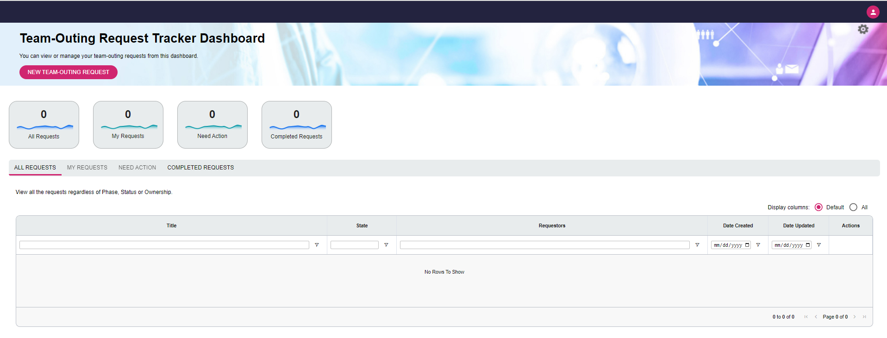

# Getting Started

This document describes how to build and run the DLMS (Document Lifecycle Management System) sample application.

## Install & run Mongo DB

1. Install and run the community edition of MongoDB as described [here](https://www.mongodb.com/docs/manual/installation/).
2. Once the installation is complete run the mongo DB instance on your local machine. By default the mongo DB does not have any user ID or password. 

## Build Application

1. Clone this repository on your local system.

2. From a command prompt, change directory to the `code` subdirectory of the cloned repository directory.

3. To build the application, run the below command at a command prompt

    ```
    npm run build
    ```

    The build takes a while, so be patient.  If the build is successful, it will end with output similar to the following.
    ```
    ...
    The build folder is ready to be deployed.
    You may serve it with a static server:

        npm install -g serve
        serve -s build

    Find out more about deployment here:

        https://cra.link/deployment
    ```

    One thing to note is that the previous build command builds both the server component as well as the ui component.

## Run Application

1. To run the sample application, ensure that Mongo DB is running locally.

2. From a command prompt, change directory to the `code` subdirectory of the cloned repository directory.

3. To start the sample application API server, run the following command.

    For Windows:
    ```
    npm run debug-no-auth.windows
    ```

    For Linux:
    ```
    npm run debug-no-auth
    ```

    If the API server starts sucessfully, output similar to the following will be found in the command prompt log:
    ```
    ...
    INFO app OAuth authentication is disabled
    DEBUG authBasic Adding basic auth middleware
    Looking for React dev server on port 4001
    Not running on port, so start it
    INFO app Listening on port 4000
    DEBUG app React:  
    > ui@0.1.0 start
    > react-scripts start
    DEBUG app React:  Starting the development server...
    ...
    DEBUG app React:  No issues found.
    ```

    > **Note:** You need to wait until the "No issues found" prompt is displayed before loading the app in your browser.

    When running the sample application, it will try to connect to the database.  By default, it will try to connect to a Mongo server running at 127.0.0.1 on port 27017.  If instead you are interested in using an existing Mongo server, you may use any of the following environment variables to allow yourself this flexibility:

    MONGO_USER
    MONGO_PASS
    MONGO_HOST
    MONGO_PORT
    
    To start the server in production mode, set the environment variable

    ```
    NODE_ENV=production
    ```
    
    Note that the default authenticated user is "requestor".  There are three users that are pre-defined in the sample application:

    * admin
    * requestor
    * reviewer

    With the `debug-no-auth` script, anyone using the app is authenticated as the default user.  To specify a different default user, the app must be restarted with the `USER` environment variable set to one of the three pre-defined users.  For example, to run as "admin".

    For Windows:
    ```
    set USER=admin && npm run debug-no-auth.windows
    ```

    For Linux:
    ```
    USER=admin npm run debug-no-auth
    ```

    Likewise, to run as "reviewer":

    For Windows:
    ```
    set USER=reviewer && npm run debug-no-auth.windows
    ```

    For Linux:
    ```
    USER=reviewer npm run debug-no-auth
    ```

4. If the API server didn't automatically start the React Development server, you can manually start it.  After the API server has started, in a new command prompt, you can run the sample application UI (user interface) in a React Development server by changing the current directory to the `code/src/ui` subdirectory and running the following command:

    For Windows:
    ```
    set REACT_APP_SERVER=4000 && npm run start
    ```

    For Linux:
    ```
    REACT_APP_SERVER=4000 npm run start
    ```

    The UI component takes a while to start, but once it starts successfully, you will see output similar to the following:

    ```
    ...
    webpack compiled with 0 warnings
    No issues found
    ```

    Developers often choose to run a React Development server in addition to the API server as this allows for a more repsonsive development experience.  As developers modify the UI files, they will be hotloaded and the changes will be reflected in the UI without a re-build.

5. Open an web browser and visit the following URL:

    ```
    http://localhost:4000
    ```
    The browser should look similar to the following:
    
    .

    Congratulations!  You have successfully built and started the DLMS sample application.

    Next, see [understanding how the sample application works](./UnderstandingSampleApp.md).

## Run with Authentication

The example can also be enabled to use basic authentication by setting the `BASIC_AUTH_ENABLED` environment variable to "true".  There is an npm script called `debug-basic-auth` that does this for you.  

1. To run the sample app with authentication, enter the following command.

    For Windows:
    ```
    npm run debug-basic-auth.windows
    ```

    For Linux:
    ```
    npm run debug-basic-auth
    ```

2. There are three users defined in `code/src/myUserProfileService.ts`.

    * id = admin,  password = pw
    * id = requestor,  password = pw
    * id = reviewer,  password = pw

    Load the URL for the our sample app on port 4000:

    ```
    http://localhost:4000
    ```

    If you are not logged in, the browser will redirect to /login and display.

    

    Enter one of the ids and passwords listed above to log in as that user.

3. To see which user is currently logged in, click on the user avatar.

    

4. To log out, click on the Logout button from the user avatar dropdown.

    This redirects you to the /logout URL

    ```
    http://localhost:4000/logout
    ```
