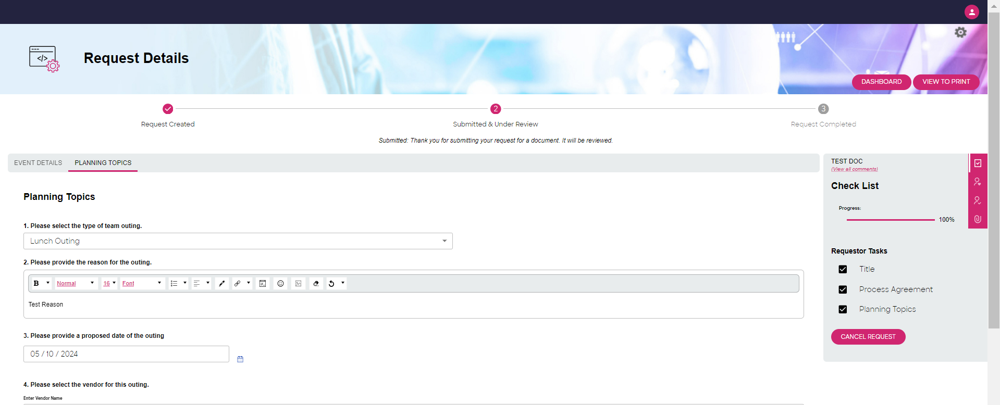
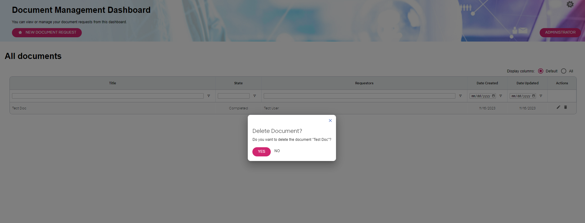

# Understanding How the DLMS Sample Application Works

This is a tutorial to help you understand how the DLMS Sample Application works.

The use case assumed in this sample application is the following:

1. a team outing needs to be planned and scheduled,
2. a requestor creates a request for the team outing, and
3. a reviewer approves or rejects that request.

There are personas for this sample application:

1. `Admin` - an administrator for this application;
2. `Requestor` - a requestor of a team outing;
3. `Reviewer` - a reviewer who either approves or rejects a request for a team outing.

> NOTE: DLMS supports OIDC/OAUTH, LDAP, and HTTP basic authentication.  For simplicity, this sample application simply hardcodes three users (`admin`, `requestor`, and `reviewer`) to  match the three personas.  The password for each user is "pw".

Now, let's begin the tutorial to help you understand how the DLMS sample application works.

## Step 1: Set up (performed by `Admin`)

In this step, `Admin` logs in and gives `Reviewer` the needed privileges.

> Assumption: The application is running locally as described in the [Getting Started Guide](./GettingStarted.md).

1. Visit `http://localhost:4000` in your browser and login as `admin` (with password "pw") and the application dashboard will appear as shown below.

   

    There are multiple tabs on this page as follows:
    * The `Needs Action` tab displays a list of documents which are waiting on some action to be performed by you, the logged-in user.
    * The `All Requests` tab displays all documents for which you have access.
    * The `My Requests` tab contains only those documents for which you were the requestor. 
    * The `Completed Requests` tab displays all documents for which you have access and which are either approved or cancelled.

2. Click on the `Administrator` button to navigate to the following page: 

2. Expand `Group Name` dropdown and select Reviewer. This selection will change the group to edit as shown in the image below:

3. Click the input section which says `Email of new member to add to group` and provide an email id (e.g., reviewer@test.com) and click the `+` sign beside it to add that member to the group. The entered email will be added in the list of `Reviewers`.

**Note:** You need to mention the emails of the users defined in  users array in `code/myUserProfileService.js`. You can always add a new user by copying any of the existing users and changing the values.

## Step 2: Create request (performed by `Requestor`)
1. Visit `http://localhost:4000` in your browser and login as `Requestor`.  You may need to logout first.
2. Click on `NEW TEAM-OUTING REQUEST` to open the request details page. To start a request fill the `Event Details` form. Note that the form spreads accross two tabs, `Event Details` (this tab is highlighted by default) and `Planning Topics`

3. The Submit Request button will become available after all the required fields on `Event Details` and `Planning Topics` are filled.
  
  
4. When all the mandatory fields are provided then `Submit Request` button becomes enabled. Click `Submit Request` to submit the request. You should see the following page once the request is submitted
   
5. Now the request is submitted for review and approval. Requestor always has the option to cancel a requested created/submitted by him.
6. Click the `Dashboard` button and the user will be shown the below page
.
7. If user clicks the "All Request" tab then the newly created request can be seen as shown below
.   

## Step 3: Review request (performed by `Reviewer`)
1. Visit `http://localhost:4000` in your browser and login as `Reviewer`. You may need to logout first. Once logged in the requestor will see the following page, showing the list of requests assigned to the requestor to review and take action on.
  
2. Click on the edit sign under the `Action` column corresponding to a request which you want to review. The below page should be visible

3. Click on any of the available buttons based on your decision about this request.

## Step 4: Locating a document (performed by any user )
1. Visit `http://localhost:4000` in your browser and login (if already loggedin and not on the `Dashboard` page, then navigate to `Dashboard` by clicking the `Dashboard` button in the top right corner of the screen
2. When the user comes to the `Dashboard` page the user might see a number of requests in any of the tabs `Need Action`, `All Requests`, `My Requests` or `Completed Request`
3. Each of the rows has associated with them edit and delete icons. We'll describe the functions of these icons in the `Edit an Existing Document` and `Delete an Existing Document` sections respectively.

4. The table has option to sort/filter the rows by each of the columns by clicking the column names.
  
5. The table has option to search (or filter) the rows based on the labels associated to column on which the filter is being operated on.

Note that the search is case-insensitive and supports partial match.

## Step 5: Editing an Existing Request (performed by `Requestor`)
1. Visit `http://localhost:4000` in your browser and log in (if already logged in and not on the `Dashboard` page, then navigate to `Dashboard` by clicking the `Dashboard` button in the top right corner of the screen
2. Click on the `All Requests` tab to see the list of requests created by the logged in user.

3. Click on the edit icon under the `Action` column of the request you wish to edit. The system will open an editable version of the request details page of the request.

Note that all the details of the document is pre-populated
3. Make the required update and tab out, changes will be saved automatically.

## Step 6: Deleting an Existing Request (performed by `Admin`)
1. Visit `http://localhost:4000` in your browser and login as `Admin`.  You may need to logout first. Click `All Requests` 
  
2. Notice the delete icon for each of the rows  under `Action` column.
3. Clicking the delete icon of the request to be deleted will prompt a confirmation modal to confirm the deletion of the selected request.

Note: Remember that after confirming the document’s deletion it’ll be deleted permanently and the change can’t be undone.
Now that you have a firm understanding of how the application works, look [behind the scenes](./CustomizingSampleApp.md) to see how the design and structure of the application was driven by the user scenarios.